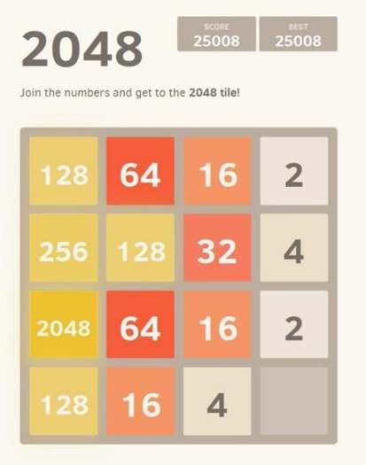
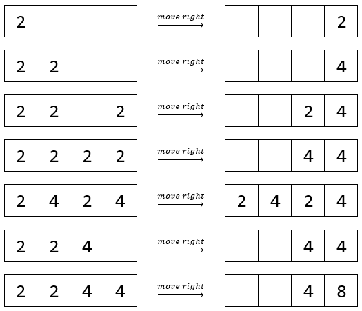

TCD3 - Project
==============

## 1. Game 2048

The game *2048* (https://play2048.co) is a single-player sliding tile puzzle game. Its objective is to slide numbered tiles on a grid to combine them to larger numbers, eventually creating a tile with the value of 2048. The following figure shows a screenshot of the game.

The rules of the game can be summarized as follows:
  * The board consists of 16 tiles (4 x 4).
  * When starting the game, the board is initialized with 2 randomly positioned tiles.
  * The value of each new tile is randomly chosen from 2 and 4, whereby 2 has a higher probability of 90%.
  * At each turn, the player can choose in which direction the tiles should be moved (either `up`, `down`, `left`, or `right`).
  * All tiles move in the specified direction as far as they can.
  * If two tiles with the same value touch they are merged, and the value is doubled. An already merged tile cannot be merged again in the same move. Tiles which are further in the direction of the move are merged first.
  * Each time when two tiles are merged, the score is increased by the value of the merged tiles.
  * After each move, a new tile is created at an empty position of the board, which is chosen at random. Again, the value of this new tile is either 2 (90% probability) or 4 (10% probability).
  * If two tiles are merged to the value of 2048, the player wins the game.
  * If no new tile can be created after a move because there are no empty positions left, the player loses the game.

The following examples illustrate how tiles are moved and merged in a single row when the player chooses to move to the right:

Your task is to implement a web application for the game, to test it with unit tests, and to set up a CI/CD pipeline to build, test, package, and deploy the application automatically. Thereby follow the following steps:
  * Start with the backend of the game by implementing a class `Board` which represents the grid and offers a `move` method to move and merge tiles. Implement another class `GameImpl` which uses an instance of `Board` and implements the logic of the game. Keep the SOLID principles in mind in order to create well-structured and testable code.
    * Apply *test-driven development* (TDD). Focus on a strict TDD loop (write a failing test &rarr; make the test pass &rarr; refactor) and document your development process.
    * Your goal is to achieve 100% line and branch coverage of your implementation, which you should also evaluate and document.
  * Set up a CI/CD pipeline using GitHub Actions to build, test, package, and deploy your application. Use a GitHub hosted runner to execute the build, test, and package step, and a self-hosted runner for deploying the application.
